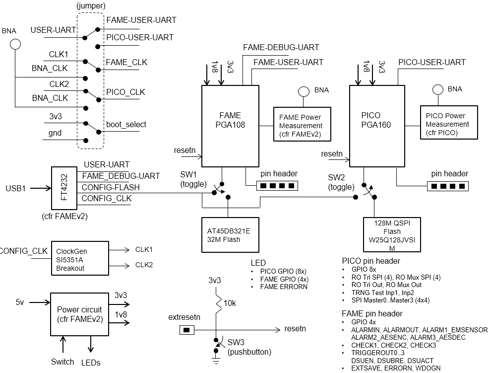

.. picopcb

.. _pcb :

PicoPCB
=======

Overview
""""""""

* The PicoPCB is a test platform for two different chips: FAMEv2 and Picochip. PicoPCB provides the following support functionality for testing FAMEv2 and Picochip: progammable clock generation, power control, passive power measurement, flash programming, user UART.

   PicoPCB Block Diagram

.. figure:: images/picopcb.png
   :figwidth: 600px
   :align: center

   PicoPCB Top Layer View

* PicoPCB Schematics: :download:`PDF <pdf/pico_pcb_1.0.pdf>`

Jumper Settings
"""""""""""""""

