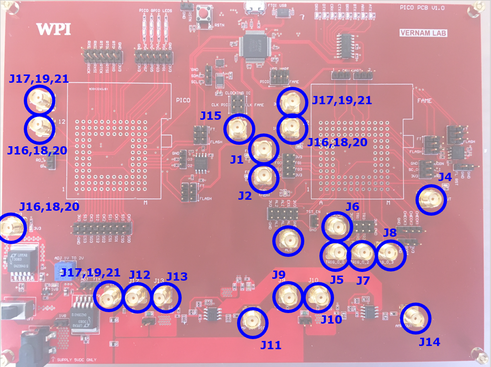

.. picopcb

.. _pcb :

PicoPCB
=======

Overview
""""""""

* The PicoPCB is a test platform for two different chips: FAMEv2 and Picochip. PicoPCB provides the following support functionality for testing FAMEv2 and Picochip: progammable clock generation, power control, passive power measurement, flash programming, user UART.

* PicoPCB Schematics: :download:`PDF <pdf/pico_pcb_1.0.pdf>`

.. figure:: images/pcbblockdiagram.png
   :figwidth: 600px
   :align: center

   PicoPCB Block Diagram

.. figure:: images/picopcb.png
   :figwidth: 600px
   :align: center

   PicoPCB Top Layer View

Jumper Settings
"""""""""""""""

.. figure:: images/picojumper.png
   :figwidth: 600px
   :align: center

   PicoPCB Jumper Locations

+--------+---------+--------------------------------------------+
| Symbol | Pins    | Function                                   |
+========+=========+============================================+
| P1     | 2       | 5v barrel connector 2.5x5.5mm              |
+--------+---------+--------------------------------------------+
| P2     | 1x3     | Select between fixed/adj voltage supply    |
+--------+---------+--------------------------------------------+
| P3     | 2x6     | PICO GPIO pins                             |
+--------+---------+--------------------------------------------+
| P4     | 2x9     | PICO SPI pins                              |
+--------+---------+--------------------------------------------+
| P5     | 2x6     | PICO RO control interface                  |
+--------+---------+--------------------------------------------+
| P6     | 1x3     | PICO Flash ext access bits d2 d3           |
+--------+---------+--------------------------------------------+
| P7     |         |                                            |
+--------+---------+--------------------------------------------+
| P8     |         |                                            |
+--------+---------+--------------------------------------------+
| P9     |         |                                            |
+--------+---------+--------------------------------------------+
| P10    |         |                                            |
+--------+---------+--------------------------------------------+
| P11    |         |                                            |
+--------+---------+--------------------------------------------+
| P12    |         |                                            |
+--------+---------+--------------------------------------------+
| P13    |         |                                            |
+--------+---------+--------------------------------------------+
| P14    |         |                                            |
+--------+---------+--------------------------------------------+
| P15    |         |                                            |
+--------+---------+--------------------------------------------+
| P16    |         |                                            |
+--------+---------+--------------------------------------------+
| P17    |         |                                            |
+--------+---------+--------------------------------------------+
| P18    |         |                                            |
+--------+---------+--------------------------------------------+
| P19    |         |                                            |
+--------+---------+--------------------------------------------+
| P20    |         |                                            |
+--------+---------+--------------------------------------------+
| P21    |         |                                            |
+--------+---------+--------------------------------------------+
| P22    |         |                                            |
+--------+---------+--------------------------------------------+
| P23    |         |                                            |
+--------+---------+--------------------------------------------+
| P24    |         |                                            |
+--------+---------+--------------------------------------------+
| P25    |         |                                            |
+--------+---------+--------------------------------------------+
| P26    |         |                                            |
+--------+---------+--------------------------------------------+
| P27    |         |                                            |
+--------+---------+--------------------------------------------+
| P28    |         |                                            |
+--------+---------+--------------------------------------------+
| P29    |         |                                            |
+--------+---------+--------------------------------------------+
| P30    |         |                                            |
+--------+---------+--------------------------------------------+
| P31    |         |                                            |
+--------+---------+--------------------------------------------+
| P32    |         |                                            |
+--------+---------+--------------------------------------------+
| P33    |         |                                            |
+--------+---------+--------------------------------------------+

SNA Connectors
""""""""""""""

   PicoPCB SNA Locations
